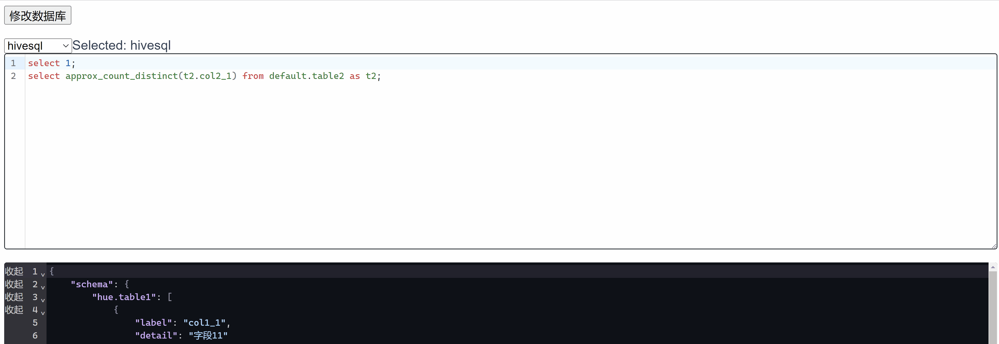

# CodeMirror6 vue2 demo

基于CodeMirror6的SQL和JSON编辑器，相比于monaco-editor，更轻量
- 支持切换数据库类型
- 支持表名和字段名提示，并可根据使用的库表实时更新提示

Give it a spin
[CodeSandbox](https://codesandbox.io/p/github/yi-you/CodeMirror6-vue2-demo/csb-8r1lcw/draft/silly-rain?file=%2FREADME.md)


## Project setup
```
npm install
```

### Compiles and hot-reloads for development
```
npm run serve
```
Then open http://localhost:8081/

### Compiles and minifies for production
```
npm run build
```

### Lints and fixes files
```
npm run lint
```

### Customize configuration
See [Configuration Reference](https://cli.vuejs.org/config/).
